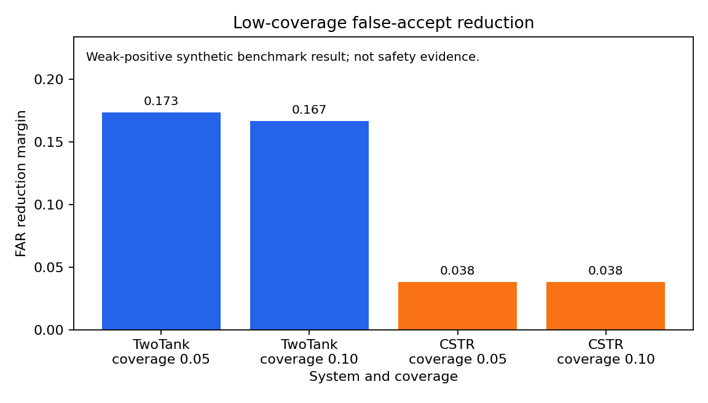

# Selective Counterfactual Simulation Benchmark

A benchmark for testing whether learned dynamical simulators know when to refuse counterfactual predictions.

Plug in a simulator, run OOD/intervention scenarios, and compare false-accept rate versus coverage.

**Current v2 finding:** calibrated refusal is target-dependent and not reliable for event-risk. This is a benchmark result, not a method-success claim.

<!-- SCS_PUBLIC_LANDING_START -->

## Why this exists

Learned simulators can look accurate in-distribution and still fail under counterfactual intervention shift. This benchmark asks a narrower question: can a simulator or refusal judge rank scenarios by answerability and abstain on risky ones?

## Quickstart

```bash
pip install -e ".[dev]"
pytest -q
python scripts/run_benchmark.py --model examples/custom_model_example.py:DampedLinearUserModel --output results/public_benchmark_run
python scripts/v2_build_public_event_risk_figure.py --config configs/v2/v2_public_benchmark_hardening.yaml --output docs/v2/figures/event_risk_vs_rmse_public.png
```

## Reproduce the main TwoTank result

```bash
python scripts/reproduce_main_twotank_result.py --output results/reproduce_twotank
```

This reads the frozen TwoTank low-coverage artifact and writes a small reproduction table and figure with the nonzero margins.

## Plug in your own simulator

Start from `examples/my_model_template.py` or the runnable example in `examples/custom_model_example.py`, then compare locally:

```bash
python scripts/run_benchmark.py --model examples/custom_model_example.py:DampedLinearUserModel --output results/public_benchmark_run
python scripts/run_benchmark.py --models linear_narx mlp_state_space --output results/public_benchmark_builtin
```

Custom model outputs are local comparison results only; they are not added to the frozen evidence claim.

## Main result



The current v2 result is target-dependent: RMSE can look near-neutral while event-risk worsens.

Current allowed claim: The benchmark exposes target-dependent calibrated-refusal failure; v2 does not support a robust method claim.

## What this does not claim

This benchmark does not claim simulator safety, product readiness, broad simulator reliability, high-coverage reliability, plant-wide deployment, autonomous control, RSSM evidence, heat-exchanger evidence, or third-system evidence.

## Repository map

- `src/scs/systems/`: synthetic systems.
- `src/scs/models/`: benchmark model interface and built-in baselines.
- `src/scs/validators/`: refusal/risk signals and judges.
- `src/scs/metrics/`: trajectory, event, and risk-coverage metrics.
- `src/scs/experiments/`: reproducible experiment and packaging logic.
- `configs/`: frozen experiment, audit, and status configs.
- `docs/`: benchmark card, task definition, failure gallery, and reproducibility notes.
- `reports/` and `results/`: generated evidence artifacts.

<!-- SCS_PUBLIC_LANDING_END -->

## Detailed generated status blocks

<!-- SCS_CURRENT_STATUS_START -->
## Current Evidence Status

**Current allowed claim:** A weak but positive low-coverage result under the frozen protocol.

**Expansion status:** Expansion is currently blocked.

**Controlling gates:**
- Practical utility gate: `NARROW_TO_WEAK_LOW_COVERAGE_CLAIM`
- Repair signal role gate: `MARK_REPAIR_DIAGNOSTIC_ONLY_FOR_CSTR`

**What is supported:**
- TwoTank: calibrated low-coverage refusal has a practically meaningful positive effect.
- CSTR: calibrated low-coverage refusal has a positive but practically weak effect.
- `repair_amount` is correct as a bounds/projection signal but diagnostic-only for CSTR.
- `invariant_residual` is much more informative than repair on CSTR.

**What is not supported:**
- strong general selective simulation
- high-coverage reliability
- safety certification
- product readiness
- autonomous control
- plant-wide digital twin claims
- RSSM or third-system evidence
<!-- SCS_CURRENT_STATUS_END -->

<!-- SCS_USABILITY_START -->
## Quickstart

```bash
pip install -e ".[dev]"
pytest -q
python scripts/run_current_status_demo.py
```

## Run the Current Status Demo

```bash
python scripts/run_current_status_demo.py --config configs/status/benchmark_usability_v1_1.yaml --output results/demo
```

The demo is a quick local run, not the full evidence chain.

## What This Benchmark Tests

It tests refusal/ranking behavior for counterfactual simulator rollouts under intervention shift.

## What This Benchmark Does Not Test

It does not test simulator safety, product readiness, plant-wide deployment, RSSM evidence, third-system evidence, autonomous control, or high-coverage reliability.

## Add Your Own Model

Implement the adapter in `src/scs/models/user_model.py`, inspect `examples/custom_model_example.py`, and run:

```bash
python examples/custom_model_example.py --output results/custom_model_example
```

## Local Model Comparison

```bash
python scripts/compare_models.py --config configs/experiments/calibrated_two_tank.yaml --models hold_last linear_narx mlp_state_space --output results/model_comparison
```

Custom model example:

```bash
python scripts/compare_models.py --config configs/experiments/calibrated_two_tank.yaml --models linear_narx mlp_state_space --custom-model examples/custom_model_example.py:DampedLinearUserModel --output results/model_comparison_custom
```

## Current Evidence Status

A weak but positive low-coverage refusal benchmark under a frozen protocol. TwoTank is stronger than CSTR. repair_amount is diagnostic-only for CSTR; invariant_residual is informative for CSTR.

## Reproducibility

Run the install, test, demo, and comparison commands above from the repository root.

## Claim Boundaries

This usability release does not change the scientific claim. It does not add RSSM, third-system evidence, new benchmark systems, product API, frontend, or deployment work.
<!-- SCS_USABILITY_END -->

This repository tests one research question:

> Can a learned or hybrid simulator identify which counterfactual intervention scenarios it can answer reliably and abstain on the rest?

The first milestone is an end-to-end smoke benchmark on a simulated TwoTank system. It trains three lightweight simulator models, evaluates at least six refusal judges, and produces risk-coverage artifacts:

- `results/smoke_two_tank/risk_coverage.csv`
- `results/smoke_two_tank/risk_coverage.png`
- `results/smoke_two_tank/summary.json`
- `reports/smoke_report.md`

The primary metric is false accept rate at fixed coverage. A false accept occurs when a judge accepts a scenario whose simulator prediction is materially wrong under the configured error threshold.

## Historical Evidence Milestones

The marker block above is the authoritative current status. The milestones below are retained as evidence history, not as permission to expand beyond the current weak low-coverage claim.

The v0 evidence audit downgraded the primary claim. `combined_linear` did not robustly beat the strongest simple judge in the claim audit or seed sweep, so it should be treated as an exploratory baseline until v0 is fixed and re-audited.

The calibrated refusal-judge milestone replaces the failed `combined_linear` claim with a narrower low-coverage claim. Current calibrated evidence status:

- single calibrated TwoTank run: `SUPPORTED_LOW_COVERAGE`
- calibrated seed sweep: `ROBUST_LOW_COVERAGE`
- threshold/coverage stress: `ROBUST_LOW_COVERAGE_ONLY`
- calibrated decision gate: `PROCEED_TO_CSTR`
- CSTR frozen-protocol sanity: `VALID_CSTR_BENCHMARK`
- single calibrated CSTR run: `SUPPORTED_LOW_COVERAGE`
- calibrated CSTR seed sweep: `ROBUST_LOW_COVERAGE`
- calibrated CSTR threshold/coverage stress: `ROBUST_LOW_COVERAGE_ONLY`
- multi-system calibrated gate: `TWO_SYSTEM_LOW_COVERAGE_SUPPORTED`

The multi-system gate allows only the bounded claim stated in `reports/multi_system_calibrated_decision_gate.md`. RSSM, product/platform work, and any frontend/API expansion remain out of scope.

## Non-goals

This is not a product, service, plant-wide digital twin, control stack, API, frontend, or safety certification workflow. The v0 scope is a runnable benchmark with explicit failures and measured risk-coverage curves.

## Quickstart

```bash
python -m venv .venv
source .venv/bin/activate
pip install -e ".[dev]"
pytest -q
python scripts/run_smoke.py
```

## Main Commands

```bash
python scripts/generate_data.py --config configs/experiments/smoke_two_tank.yaml
python scripts/train_model.py --config configs/experiments/smoke_two_tank.yaml --model linear_narx
python scripts/evaluate_selective.py --config configs/experiments/smoke_two_tank.yaml
python scripts/make_report.py --results results/smoke_two_tank
python scripts/run_smoke.py
python scripts/audit_claim.py --results results/smoke_two_tank
python scripts/make_decision_gate.py
python scripts/verify_calibrated_judge_preconditions.py
python scripts/run_calibrated_judge.py --config configs/experiments/calibrated_two_tank.yaml --output results/calibrated_two_tank
python scripts/run_calibrated_seed_sweep.py --config configs/experiments/calibrated_two_tank.yaml --seeds 0 1 2 3 4 5 6 7 8 9 --output results/calibrated_seed_sweep_two_tank
python scripts/run_calibrated_stress.py --config configs/experiments/calibrated_two_tank.yaml --thresholds 0.05 0.10 0.15 0.20 0.30 0.50 --coverages 0.05 0.10 0.20 0.40 0.60 0.80 1.00 --seeds 0 1 2 3 4 --output results/calibrated_stress_two_tank
python scripts/make_calibrated_judge_decision_gate.py --single-run results/calibrated_two_tank/calibrated_judge_summary.json --seed-sweep results/calibrated_seed_sweep_two_tank/seed_sweep_calibrated_summary.json --stress results/calibrated_stress_two_tank/stress_summary.json --output reports/calibrated_judge_decision_gate.md
python scripts/verify_cstr_preconditions.py --protocol docs/calibrated_protocol_lock_v1.md --output results/cstr_preconditions
python scripts/run_cstr_sanity.py --config configs/experiments/calibrated_cstr.yaml --output results/cstr_sanity
python scripts/run_calibrated_judge.py --config configs/experiments/calibrated_cstr.yaml --output results/calibrated_cstr
python scripts/run_calibrated_seed_sweep.py --config configs/experiments/calibrated_cstr.yaml --seeds 0 1 2 3 4 5 6 7 8 9 --output results/calibrated_seed_sweep_cstr
python scripts/run_calibrated_stress.py --config configs/experiments/calibrated_cstr.yaml --thresholds 0.05 0.10 0.15 0.20 0.30 0.50 --coverages 0.05 0.10 0.20 0.40 0.60 0.80 1.00 --seeds 0 1 2 3 4 --output results/calibrated_stress_cstr
python scripts/make_multi_system_calibrated_decision_gate.py --twotank-single results/calibrated_two_tank/calibrated_judge_summary.json --twotank-seed results/calibrated_seed_sweep_two_tank/seed_sweep_calibrated_summary.json --twotank-stress results/calibrated_stress_two_tank/stress_summary.json --cstr-sanity results/cstr_sanity/cstr_label_checks.json --cstr-single results/calibrated_cstr/calibrated_judge_summary.json --cstr-seed results/calibrated_seed_sweep_cstr/seed_sweep_calibrated_summary.json --cstr-stress results/calibrated_stress_cstr/stress_summary.json --output reports/multi_system_calibrated_decision_gate.md
```
