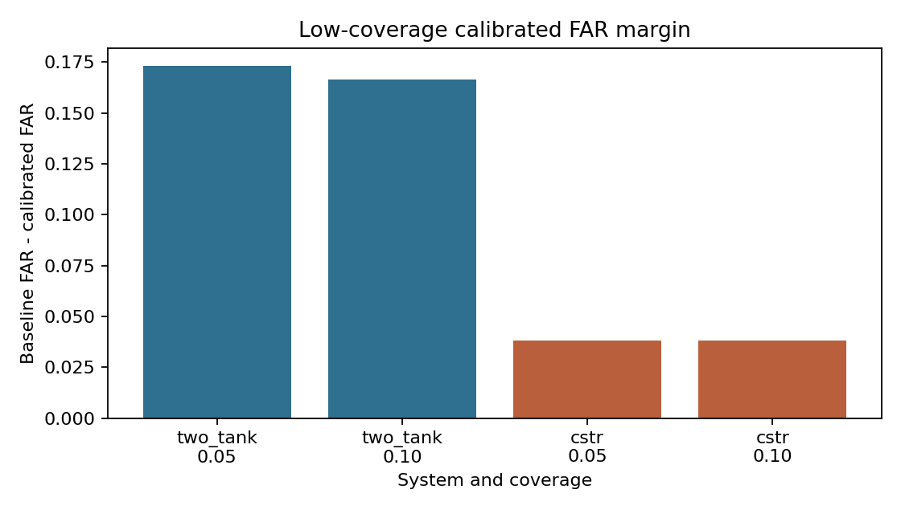
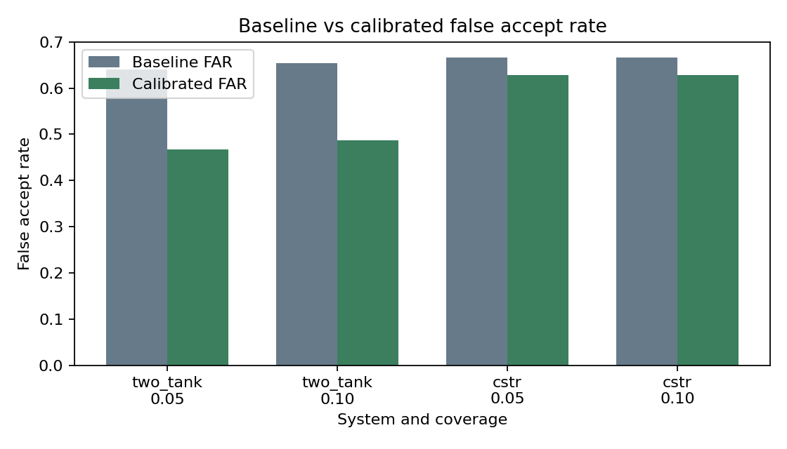
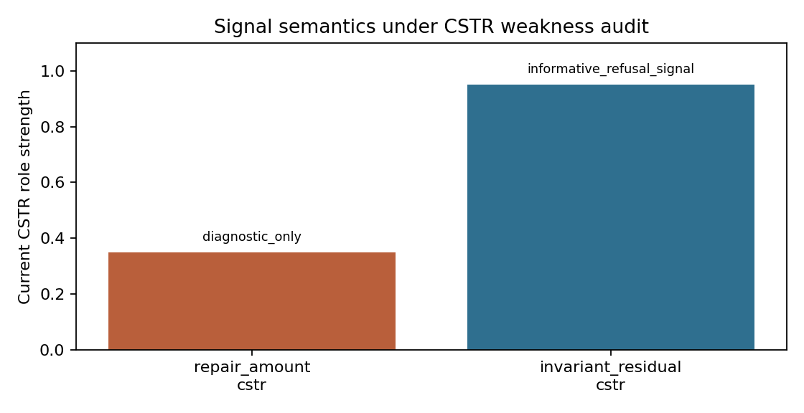
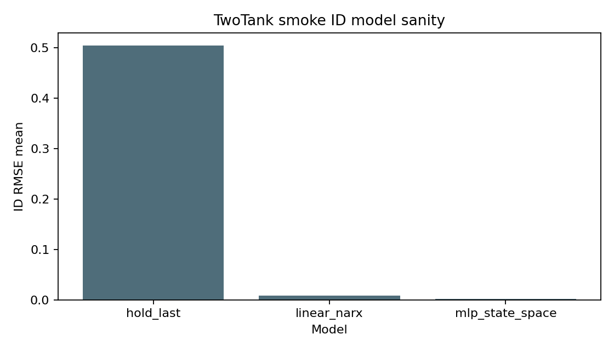

# When Should a Learned Simulator Refuse? A Weak-Positive Benchmark on Synthetic Dynamical Systems

## Abstract

This note packages the current state of the Selective Counterfactual Simulation benchmark. It is limitations-first: the benchmark shows a useful TwoTank low-coverage result, a weaker CSTR replication, and a clear signal-semantics failure for repair amount on CSTR. The current evidence supports only a weak but positive low-coverage refusal result under a frozen protocol.

## One-sentence claim

The current evidence supports only a weak but positive low-coverage refusal result under a frozen protocol.

## Non-claims

This is not safety certification.
This is not a product-ready digital twin.
This is not a claim of general simulator reliability.
This is not high-coverage reliability.
This is not evidence for RSSM or a third system.

## Motivation

The benchmark asks whether a learned or hybrid simulator can rank counterfactual intervention scenarios by answerability and refuse the riskiest cases. The package is useful as a research-engineering artifact because the conclusion is explicit about where the evidence works and where it does not.

## Benchmark setup

The protocol is frozen around existing synthetic dynamical-system artifacts. The package reads existing result tables and decision gates; it does not introduce new systems, models, judges, or success rules.

## Systems

Two systems provide the current evidence. TwoTank is the stronger result and CSTR is the weakness check. Heat-exchanger results and RSSM results are not part of the evidence package.

## Models

The smoke sanity table includes `hold_last`, `linear_narx`, and `mlp_state_space`. On TwoTank ID smoke data, the ID RMSE means are:

| model | id_rmse_mean |
| --- | ---: |
| hold_last | 0.504806 |
| linear_narx | 0.007754 |
| mlp_state_space | 0.001180 |

## Refusal signals

The calibrated judge uses existing refusal signals. The important semantic update is that repair amount is not universal.

| signal | system | role | key_finding |
| --- | --- | --- | --- |
| repair_amount | cstr | diagnostic_only | AUROC 0.500000; diagnostic-only for within-bound CSTR errors |
| invariant_residual | cstr | informative_refusal_signal | AUROC 0.954061; much more informative for CSTR |

## Calibration protocol

The calibrated protocol selects low-risk scenarios under frozen train/calibration/test separation and evaluates false accept rate at fixed coverage. The practical utility gate decision is `NARROW_TO_WEAK_LOW_COVERAGE_CLAIM`.

## Primary metric

The primary metric is false accept rate at fixed coverage. Lower false accept rate at the same coverage is better.

## Main result



TwoTank has a coverage 0.05 margin of 0.173333 and a coverage 0.10 margin of 0.166667. CSTR has a coverage 0.05 margin of 0.038095 and a coverage 0.10 margin of 0.038095. The effect-size verdict is `WEAK_TWO_SYSTEM_EFFECT`.



## Negative result: combined_linear failed

The original v0 `combined_linear` claim was downgraded. The current package treats it as an exploratory baseline, not as a supported broad refusal method.

## Weakness: CSTR effect is positive but small

CSTR is positive at low coverage, but the margins are small: 0.038095 at coverage 0.05 and 0.038095 at coverage 0.10. This is why the current allowed claim remains weak.

## Signal semantics: repair is not universal

The repair role decision is `MARK_REPAIR_DIAGNOSTIC_ONLY_FOR_CSTR`. CSTR repair AUROC is 0.500000, while CSTR invariant residual AUROC is 0.954061. repair_amount is diagnostic-only for CSTR; invariant_residual is much more informative for CSTR.



## Failure analysis summary

The CSTR failure mode is mostly within-bound dynamic error, so a bounds/projection signal does not separate the bad accepted cases. The invariant residual is closer to the actual failure mechanism.

## Limitations

- The result is low-coverage only.
- CSTR is positive but weak.
- Expansion is blocked.
- No safety, product, or general reliability claim is supported.
- No RSSM, third-system, high-coverage, or plant-wide claim is supported.

## Reproducibility

Run:

```bash
pip install -e ".[dev]"
pytest -q
python scripts/run_smoke.py
python scripts/check_technical_note_package.py --config configs/status/technical_note_package.yaml --manifest results/technical_note_package/package_manifest.json
```

Main source figures are in `docs/figures`.



## Conclusion

This package should be read as a disciplined weak-positive benchmark state, not as a broad simulator-reliability result. The most useful next action is to maintain the repo as a weak-positive benchmark and use the negative findings to guide future paper planning.
